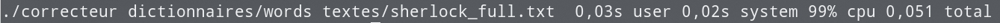

# Projet Programmation Avancée : Correcteur Orthographique 

Ce programme implémente un correcteur orthographique minimaliste écrit en C dans le cadre du cours de Programmation Avancée de Mr. [Rudametkin](https://rudametw.github.io/) d'IMA3 à Polytech'Lille. 
Auteurs : Sébastien Dardenne et Corto Callerisa


## Principe

Le programme importe un dictionnaire depuis un fichier texte passé en paramètre et s'en sert pour détecter les mots mal orthographié d'un texte donné.

## Prérequis

Un ordinateur permettant de compiler en programme C ainsi qu'environ 10mo d'espace libre. La majorité de la mémoire étant occupé par les fichiers de tests, l'éxecutable faisant environ 23Ko.

## Installation

Le projet peut être cloner par la commande
```bash
git clone git@archives.plil.fr:ccalleri/ima3_projet_pa_2019.git
```
et compilé avec

```bash
cd ima3_projet_pa_2019
make
```

## Utilisation
Arguments
```bash
./correcteur [fichier_dictionnaire] texte
```
fichier_dictionnaire : le fichier texte contenant l'ensembles des mots du dictionnaire. S'il n'est pas spécifié le dictionnaire par défaut est utilisé.

texte : texte à vérifier.

Le programme renvoie l'ensemble des mots malorthographiés sur le terminal.
## Extras : Benchmark, warnings et gestion mémoire. 

### Benchmark



### Warnings


### Gestion mémoire


## Auteurs

Sébastien Dardenne
Corto Callerisa